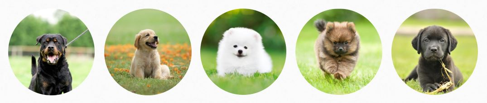
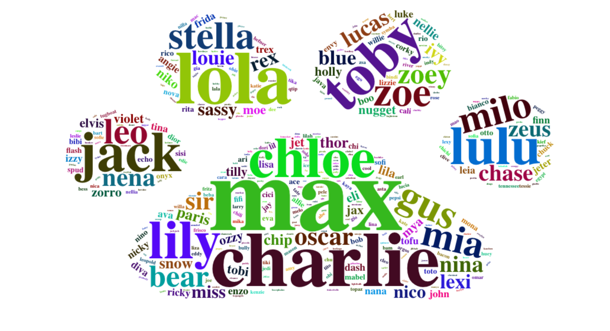
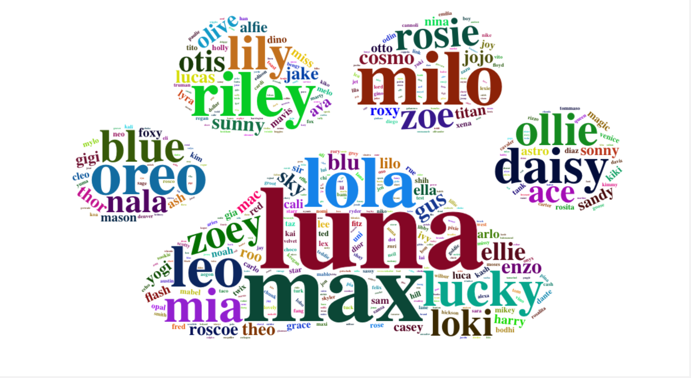

 

## Introduction
NYC is frequently ranked as one of the most dog-firendly cities in the United States. In this project, we are aiming to answer the following questions through various visualizations.

{width=25px} Where are the dogs in New York City?      
{width=25px} What are people's preferences of dogs?   
{width=25px} Who are getting more dogs?   
{width=25px} How are people naming their dogs?   

## Data
[NYC Dog Licensing Dataset](https://data.cityofnewyork.us/Health/NYC-Dog-Licensing-Dataset/nu7n-tubp) has information about registered dog licenses from 2014 to 2018 in NYC. Information such as dogs' names, breeds, and birth years are also included in this dataset.  

[uszipcode API](https://uszipcode.readthedocs.io/index.html) is a Zip Code search engine that provides demographic information such as income, housing, and education. In this project, we extracted income information using this API.

## Let's locate the dogs!

```{r, echo = FALSE, message = FALSE, warning = FALSE, include = FALSE}
library(tidyverse)
library(lubridate)
license <- read.csv('Data/NYC_Dog_Licensing_Dataset.csv')
license <- license %>% distinct(AnimalName, AnimalGender,AnimalBirthMonth,BreedName, .keep_all = TRUE) %>% select(Name = AnimalName, Gender = AnimalGender,BirthYear = AnimalBirthMonth, Breed = BreedName, ZipCode, LicenseIssuedDate) %>% mutate(RegYear = year(as.POSIXct(LicenseIssuedDate,format = "%m/%d/%Y")))
```


```{r, echo = FALSE, message = FALSE, warning = FALSE, include = FALSE}
zipcode_borough <-  read.csv('Data/nyc_Domain_Registrations_by_Zip_Code.csv') %>% mutate(ZipCode = as.numeric(as.character(ZIP.Code))) %>% select(ZipCode, Borough)
```

```{r, echo = FALSE, message = FALSE, warning = FALSE, include = FALSE}
data <- inner_join(license, zipcode_borough, by = 'ZipCode')
head(data)
```

### Across boroughs  

This choropleth map shows the number of new dog license registrations over time. The overall distribution across boroughs didn't change much during 2014-2018. Compared to other boroughs, the number of new dogs increased in Queens and Brooklyn in 2017 and 2018. While the number of new dogs is consistently the highest in Manhattan, it is the lowest in Staten Island.  

```{r, echo = FALSE, message = FALSE, warning = FALSE, error = FALSE,results='hide',fig.keep='all',fig.height = 5, fig.width = 9}
library(rgdal)
library(tmap)

choropleth <- function(Year) {
  borough <- readOGR('Data/borough_boundaries.geojson')
  boro_count <- data %>% group_by(Borough, RegYear) %>% summarise(Number_of_dogs = n()) %>% mutate(year = as.character(RegYear), Number_of_dogs = as.numeric(Number_of_dogs)) %>% select(boro_name = Borough, year, Number_of_dogs) %>% filter(year == as.character(Year))
  borough@data <- left_join(borough@data,boro_count, by = "boro_name")
  
  map <- tm_shape(borough) + tm_fill("Number_of_dogs",palette="GnBu",title = "Number of New Dogs") + tm_layout(title = Year,legend.outside=TRUE)
  return(map)
}

tmap_arrange(choropleth(2014), choropleth(2015),choropleth(2016),choropleth(2017),choropleth(2018), ncol = 2)
```


### By Zip Code

This map shows the distribution of new dogs over different Zip Codes and the most popular breed(s) in that region. Check out the dogs in your neighborhood!  

```{r, echo = FALSE, message = FALSE, warning = FALSE}
latlog <- read.csv("Data/us-zip-code-latitude-and-longitude.csv", sep = ";") %>% select(ZipCode = Zip, lat = Latitude, lng = Longitude)

MapYear <- function(year) {
  map_data <- data %>% filter(RegYear == year)
  zip_dog <- map_data %>% group_by(ZipCode) %>% summarise(DogNumber = n())
  zip_dogbreed <- map_data %>% group_by(ZipCode,Breed) %>% summarise(BreedNumber = n()) %>% top_n(1, wt = BreedNumber) %>% select(ZipCode, TopBreed = Breed)
  zip_dogbreed <- aggregate(TopBreed ~ ZipCode, data = zip_dogbreed, paste, collapse = ";")
  data_coord <- left_join(left_join(zip_dog,latlog, by = "ZipCode"),zip_dogbreed, by = "ZipCode") %>% filter(!is.na(lat) & !is.na(lng))
  
  library(leaflet)
  content <- paste("Zip Code: ",data_coord$ZipCode,"<br/>",
                    "Number of New Dogs: ",data_coord$DogNumber,"<br/>",
                    "Most Popular Breed: ",data_coord$TopBreed,"<br/>")
  DogIcon <- icons(
    iconUrl = "Image/Icon.png",
    iconWidth = 20, iconHeight = 20,
    iconAnchorX = 7.5, iconAnchorY = 8.5
    )
  my_map <- leaflet(data_coord) %>% 
    setView(-73.9742, 40.7859, zoom = 10) %>% 
    addTiles() %>% 
    addProviderTiles("CartoDB.Positron") %>% 
    addMarkers(lng = ~lng, lat = ~lat, popup = content, clusterOptions = markerClusterOptions(), icon = DogIcon) %>%
    addControl(`year`, position = "topright")
  return(my_map)
}

leafsync::sync(MapYear(2015),MapYear(2016),MapYear(2017),MapYear(2018))
```  


## Who are geting more dogs?  

We collected the income information from different Zip Codes. The scatterplot shows the relationship between median household income and the number of new registered dogs. It seems like households whose median income is from 75k - 100k are getting more dogs over these years.  
```{r, echo = FALSE, message = FALSE, warning = FALSE, include = FALSE}
incomezipcode <- read.csv("Data/ZipCodeIncome.csv") %>% select(ZipCode, MedianIncome) %>% filter(!is.na(ZipCode)) %>% filter(!is.na(MedianIncome))
incomezipcode <- left_join(data,incomezipcode, by = "ZipCode")  %>% group_by(ZipCode, MedianIncome,RegYear) %>% summarise(num_reg = n()) %>% mutate(year = as.character(RegYear))

plot_1 <- ggplot(data=incomezipcode, aes(x=MedianIncome, y=num_reg, color = year)) + geom_point(alpha=0.5, size=2) + geom_smooth(color="black", lwd=1, se=FALSE) + xlab('Median Household Income') + ylab('New Dogs Registered') + theme_classic() + theme(legend.title = element_blank()) 
```

```{r, echo = FALSE, message = FALSE, warning = FALSE}
library(plotly)
plot_ly(incomezipcode, y = ~num_reg, x = ~MedianIncome, color= ~year, type = "scatter", mode='markers') %>% layout(xaxis = list(title = 'Median Household Income'),yaxis = list(title = 'New Dogs Registered')) 
```


## Who's the most popular over time?

```{r, echo = FALSE, message = FALSE, warning = FALSE}
library(reshape2)
library(xts)
library(dygraphs)
library(gganimate)

data$Month_Yr <- as.Date(data$LicenseIssuedDate, format = "%m/%d/%Y")
data$Month_Yr <- format(as.Date(data$Month_Yr), "%Y-%m")

# get top 10 breed 
top_10 = data %>% select(c("Breed","Month_Yr")) %>% group_by(Breed) %>% count()  
top_10  = top_10[order(top_10$n,decreasing = TRUE),]
top_10_char = as.character(head(top_10$Breed,10))


data_sml = data %>% select(c("Breed","Month_Yr")) %>% 
              filter(Breed %in% top_10_char) %>% 
              group_by(Breed, Month_Yr) %>% count() %>%
              as.data.frame()

data_sml$Month_Yr = as.Date(paste0(data_sml$Month_Yr, "-01"))

data_sml_wide = dcast(data_sml,Month_Yr ~ Breed, value.var = "n")

ts_data_sml = xts(data_sml_wide, order.by = data_sml_wide$Month_Yr) 
ts_data_sml$Month_Yr <- NULL
```

### Top 10 popular dog breeds over the years

First we found 10 most popular dog breeds all the time, and then count their number for each year.

This racing bar chart shows top 10 dog breeds from 2014 to 2018.
```{r, echo = FALSE, message = FALSE, warning = FALSE}
data_sml_rank_year = data %>% select(c("Breed","Month_Yr")) %>%
                        filter(Breed %in% top_10_char) 
data_sml_rank_year$year = substr(data_sml_rank_year$Month_Yr,1,4)
data_sml_rank_year = data_sml_rank_year %>%
                        group_by(Breed, year) %>%
                        count() %>%
                        as.data.frame() 
data_new = data_sml_rank_year %>%
              group_by(year) %>%
              arrange(year,-n) %>%
              mutate(rank = 1:n())
data_new$Breed_short = as.character(data_new$Breed)
data_new$Breed_short[data_new$Breed_short == "American Pit Bull Terrier/Pit Bull"] = "Pit Bull"
data_new$Breed_short[data_new$Breed_short == "American Pit Bull Mix / Pit Bull Mix"] = "Pit Bull Mix"

my_theme <- theme_classic(base_family = "Times") +
  theme(axis.text.y = element_blank()) +
  theme(axis.ticks.y = element_blank()) +
  theme(axis.line.y = element_blank()) +
  theme(legend.background = element_rect(fill = "gainsboro")) +
  theme(plot.background = element_rect(fill = "gainsboro")) +
  theme(panel.background = element_rect(fill = "gainsboro"))

my_plot = data_new %>%
  ggplot() +
  aes(xmin = 0,
      xmax = n) +
  aes(ymin = rank+.45,
      ymax = rank-.45,
      y = rank) +
  facet_wrap(~ year) +
  geom_rect(alpha = .7) +
  aes(fill = Breed) +
  scale_fill_viridis_d(option = "magma",
                       direction =-1) +
  scale_x_continuous(limits = c(-3000,7000))+
  geom_text(col = "gray13",
            hjust = "right",
            aes(label = Breed_short),
            x = -100) +
  scale_y_reverse() +
  labs(fill = NULL) +  
  labs(x = "Top 10 Popular Dog") +  
  labs(y = "") +  
  my_theme

```


```{r, echo = FALSE, message = FALSE, warning = FALSE}
my_plot +  
  facet_null() +  
  scale_x_continuous(  
    limits = c(-3000, 7000),  
    breaks = c(0, 2500, 5000, 7000)) +  
    geom_text(x = 5000 , y = -10,
            family = "Times",
            aes(label = as.character(year)),
            size = 15, col = "grey18") +
    aes(group = Breed_short) +
    transition_time(as.integer(year))
```

### Top 5 popular dog breeds over year
To get a closer look, we used the line chart to show the trend for the top 5 breeds,. You can change the range bar below the plot to zoom in the plot!

```{r, echo = FALSE, message = FALSE, warning = FALSE}

top_5_char = as.character(head(top_10$Breed,5))


data_sml = data %>% select(c("Breed","Month_Yr")) %>% 
              filter(Breed %in% top_5_char) %>% 
              group_by(Breed, Month_Yr) %>% count() %>%
              as.data.frame()

data_sml$Month_Yr = as.Date(paste0(data_sml$Month_Yr, "-01"))

data_sml_wide = dcast(data_sml,Month_Yr ~ Breed, value.var = "n")

ts_data_sml = xts(data_sml_wide, order.by = data_sml_wide$Month_Yr) 
ts_data_sml$Month_Yr <- NULL


p <- dygraph(ts_data_sml, main = "Top 5 Breeds over time") %>%
        dyRangeSelector(dateWindow = c("2014-09-01", "2018-12-31")) %>%
        dyLegend(labelsSeparateLines = TRUE)

p
```


## What are people naming their dogs?  

Like hoomans, our four-leg friends have their popular name trends! 
The following word "paws" show that the top popular names New Yorkers give their dogs haven't changed a lot over the past 30 years. Evidently, Max has been one of the most popular name in since 1998. Luna and Lola have been popular girl names for the past 20 years. New Yorkers generally have been maintaining a simple style when it comes to dog names. Many of the most popular dog names contain less than 5 letters.  

```{r, echo = FALSE, message = FALSE, warning = FALSE, include = FALSE}
library(RColorBrewer)
library(wordcloud2)
library(wordcloud)
library(tm)
library(dplyr)
```

```{r, echo = FALSE, message = FALSE, warning = FALSE, include = FALSE}
cleaned_data_1998 = data[data$BirthYear==1998, ]
cleaned_data_2008 = data[data$BirthYear==2008, ]
cleaned_data_2018 = data[data$BirthYear==2018, ]

myCorpus_98 <- Corpus(VectorSource(cleaned_data_1998$Name))
myCorpus_08 <- Corpus(VectorSource(cleaned_data_2008$Name))
myCorpus_18 <- Corpus(VectorSource(cleaned_data_2018$Name))

mystopwords <- c("unknown", "name", "not", "provided", "none", "dog","undecided","UNKNOWN","NAME","NOT","PROVIDED","NONE","DOG","UNDECIDED")
```

### In 1998

```{r, echo = FALSE, message = FALSE, warning = FALSE, fig.keep='all',fig.height = 5, fig.width = 9}
toSpace <- content_transformer(function (x , pattern ) gsub(pattern, " ", x))
myCorpus_98 <- tm_map(myCorpus_98, toSpace, "/")
myCorpus_98 <- tm_map(myCorpus_98, toSpace, "@")
myCorpus_98 <- tm_map(myCorpus_98, toSpace, "\\|")

myCorpus_98 <- tm_map(myCorpus_98, removePunctuation)
myCorpus_98 <- tm_map(myCorpus_98, stripWhitespace)
myCorpus_98 <- tm_map(myCorpus_98, removeNumbers)
myCorpus_98 <- tm_map(myCorpus_98, removeWords, c(stopwords("english"), mystopwords))

dtm <- TermDocumentMatrix(myCorpus_98)
m <- as.matrix(dtm)
v1 <- sort(rowSums(m),decreasing=TRUE)
d1 <- data.frame(word = names(v1),freq=v1)

set.seed(4321)

wordcloud2(data=d1, size = 1, gridSize = 2, figPath = "Image/paw.png")
```

### In 2008

```{r, echo = FALSE, message = FALSE, warning = FALSE, include=FALSE}
toSpace <- content_transformer(function (x , pattern ) gsub(pattern, " ", x))
myCorpus_08 <- tm_map(myCorpus_08, toSpace, "/")
myCorpus_08 <- tm_map(myCorpus_08, toSpace, "@")
myCorpus_08 <- tm_map(myCorpus_08, toSpace, "\\|")

myCorpus_08 <- tm_map(myCorpus_08, removePunctuation)
myCorpus_08 <- tm_map(myCorpus_08, stripWhitespace)
myCorpus_08 <- tm_map(myCorpus_08, removeNumbers)
myCorpus_08 <- tm_map(myCorpus_08, removeWords, c(stopwords("english"), mystopwords))


dtm <- TermDocumentMatrix(myCorpus_08)
m <- as.matrix(dtm)
v2 <- sort(rowSums(m),decreasing=TRUE)
d2 <- data.frame(word = names(v2),freq=v2)

# Most popular dog names in 2008
set.seed(1234)
wordcloud2(data=d2, size = 1, gridSize = 5, figPath = "Image/paw.png")
```


### In 2018

```{r, echo = FALSE, message = FALSE, warning = FALSE, include=FALSE}
toSpace <- content_transformer(function (x , pattern ) gsub(pattern, " ", x))
myCorpus_18 <- tm_map(myCorpus_18, toSpace, "/")
myCorpus_18 <- tm_map(myCorpus_18, toSpace, "@")
myCorpus_18 <- tm_map(myCorpus_18, toSpace, "\\|")

myCorpus_18 <- tm_map(myCorpus_18, removePunctuation)
myCorpus_18 <- tm_map(myCorpus_18, stripWhitespace)
myCorpus_18 <- tm_map(myCorpus_18, removeNumbers)
myCorpus_18 <- tm_map(myCorpus_18, removeWords, c(stopwords("english"), mystopwords))


dtm <- TermDocumentMatrix(myCorpus_18)
m <- as.matrix(dtm)
v3 <- sort(rowSums(m),decreasing=TRUE)
d3 <- data.frame(word = names(v3),freq=v3)

set.seed(4231)
# wordcloud(words = d$word, freq = d$freq, min.freq = 1,
#           max.words=20, random.order=FALSE, rot.per=0.35,
#           colors=brewer.pal(8, "Dark2"))

wordcloud2(data=d3, size = 1, gridSize = 5, figPath = "Image/paw.png")
```


```{r, echo = FALSE, message = FALSE, warning = FALSE, include=FALSE}
bronx <- data[ which(data$BirthYear=='2018' & data$Borough=='Bronx'), ]
manhattan <- data[ which(data$BirthYear=='2018' & data$Borough=='Manhattan'), ]
queens <- data[ which(data$BirthYear=='2018' & data$Borough=='Queens'), ]
brooklyn <- data[ which(data$BirthYear=='2018' & data$Borough=='Brooklyn'), ]
si <- data[ which(data$BirthYear=='2018' & data$Borough=='Staten Island'), ]

myCorpus_bronx <- Corpus(VectorSource(bronx$Name))
myCorpus_manh <- Corpus(VectorSource(manhattan$Name))
myCorpus_queens <- Corpus(VectorSource(queens$Name))
myCorpus_bkln <- Corpus(VectorSource(brooklyn$Name))
myCorpus_si <- Corpus(VectorSource(si$Name))
```


```{r, echo = FALSE, message = FALSE, warning = FALSE, include=FALSE}
#### 2018 by borough: The Bronx

toSpace <- content_transformer(function (x , pattern ) gsub(pattern, " ", x))
myCorpus_bronx <- tm_map(myCorpus_bronx, toSpace, "/")
myCorpus_bronx <- tm_map(myCorpus_bronx, toSpace, "@")
myCorpus_bronx <- tm_map(myCorpus_bronx, toSpace, "\\|")

myCorpus_bronx <- tm_map(myCorpus_bronx, removePunctuation)
myCorpus_bronx <- tm_map(myCorpus_bronx, stripWhitespace)
myCorpus_bronx <- tm_map(myCorpus_bronx, removeNumbers)
myCorpus_bronx <- tm_map(myCorpus_bronx, removeWords, c(stopwords("english"), mystopwords))

dtm <- TermDocumentMatrix(myCorpus_bronx)
m <- as.matrix(dtm)
v <- sort(rowSums(m),decreasing=TRUE)
d4 <- data.frame(word = names(v),freq=v)
#head(d, 10)

set.seed(4001)
wordcloud(words = d4$word, freq = d4$freq, min.freq = 1,
          max.words=30, random.order=FALSE, rot.per=0.30,
          colors=brewer.pal(12, "Dark2"))

#wordcloud2(data=d4, size = 1, color = 'random-dark', gridSize = 5, figPath = 'Image/paw.png')
```


```{r, echo = FALSE, message = FALSE, warning = FALSE, include=FALSE}
#### 2018 by borough: Manhattan

toSpace <- content_transformer(function (x , pattern ) gsub(pattern, " ", x))
myCorpus_manh <- tm_map(myCorpus_manh, toSpace, "/")
myCorpus_manh <- tm_map(myCorpus_manh, toSpace, "@")
myCorpus_manh <- tm_map(myCorpus_manh, toSpace, "\\|")

myCorpus_manh <- tm_map(myCorpus_manh, removePunctuation)
myCorpus_manh <- tm_map(myCorpus_manh, stripWhitespace)
myCorpus_manh <- tm_map(myCorpus_manh, removeNumbers)
myCorpus_manh <- tm_map(myCorpus_manh, removeWords, c(stopwords("english"), mystopwords))

dtm <- TermDocumentMatrix(myCorpus_manh)
m <- as.matrix(dtm)
v <- sort(rowSums(m),decreasing=TRUE)
d5 <- data.frame(word = names(v),freq=v)

set.seed(4002)
wordcloud(words = d5$word, freq = d5$freq, min.freq = 1,
          max.words=30, random.order=FALSE, rot.per=0.30,
          colors=brewer.pal(12, "Dark2"))
#wordcloud2(data=d5, size = 1, color = 'random-dark', gridSize = 5, figPath = 'Image/paw.png')
```

```{r, echo = FALSE, message = FALSE, warning = FALSE, include=FALSE}
#### 2018 by borough: Queens

toSpace <- content_transformer(function (x , pattern ) gsub(pattern, " ", x))
myCorpus_queens <- tm_map(myCorpus_queens, toSpace, "/")
myCorpus_queens <- tm_map(myCorpus_queens, toSpace, "@")
myCorpus_queens <- tm_map(myCorpus_queens, toSpace, "\\|")

myCorpus_queens <- tm_map(myCorpus_queens, removePunctuation)
myCorpus_queens <- tm_map(myCorpus_queens, stripWhitespace)
myCorpus_queens <- tm_map(myCorpus_queens, removeNumbers)
myCorpus_queens <- tm_map(myCorpus_queens, removeWords, c(stopwords("english"), mystopwords))

dtm <- TermDocumentMatrix(myCorpus_queens)
m <- as.matrix(dtm)
v <- sort(rowSums(m),decreasing=TRUE)
d6 <- data.frame(word = names(v),freq=v)

set.seed(4003)
wordcloud(words = d6$word, freq = d6$freq, min.freq = 1,
          max.words=30, random.order=FALSE, rot.per=0.30,
          colors=brewer.pal(12, "Dark2"))

#wordcloud2(data=d6, size = 1, color = 'random-dark', gridSize = 5, figPath = 'Image/paw.png')
```


```{r, echo = FALSE, message = FALSE, warning = FALSE, include = FALSE}
#### 2018 by borough: Brooklyn

toSpace <- content_transformer(function (x , pattern ) gsub(pattern, " ", x))
myCorpus_bkln <- tm_map(myCorpus_bkln, toSpace, "/")
myCorpus_bkln <- tm_map(myCorpus_bkln, toSpace, "@")
myCorpus_bkln <- tm_map(myCorpus_bkln, toSpace, "\\|")

myCorpus_bkln <- tm_map(myCorpus_bkln, removePunctuation)
myCorpus_bkln <- tm_map(myCorpus_bkln, stripWhitespace)
myCorpus_bkln <- tm_map(myCorpus_bkln, removeNumbers)
myCorpus_bkln <- tm_map(myCorpus_bkln, removeWords, c(stopwords("english"), mystopwords))

dtm <- TermDocumentMatrix(myCorpus_bkln)
m <- as.matrix(dtm)
v <- sort(rowSums(m),decreasing=TRUE)
d7 <- data.frame(word = names(v),freq=v)

set.seed(4004)
wordcloud(words = d7$word, freq = d7$freq, min.freq = 1,
          max.words=30, random.order=FALSE, rot.per=0.30,
          colors=brewer.pal(12, "Dark2"))

#wordcloud2(data=d7, size = 1, color = 'random-dark', gridSize = 5, figPath = 'Image/paw.png')
```


```{r, echo = FALSE, message = FALSE, warning = FALSE, include = FALSE}
#### 2018 by borough: Staten Island 

toSpace <- content_transformer(function (x , pattern ) gsub(pattern, " ", x))
myCorpus_si <- tm_map(myCorpus_si, toSpace, "/")
myCorpus_si <- tm_map(myCorpus_si, toSpace, "@")
myCorpus_si <- tm_map(myCorpus_si, toSpace, "\\|")

myCorpus_si <- tm_map(myCorpus_si, removePunctuation)
myCorpus_si <- tm_map(myCorpus_si, stripWhitespace)
myCorpus_si <- tm_map(myCorpus_si, removeNumbers)
myCorpus_si <- tm_map(myCorpus_si, removeWords, c(stopwords("english"), mystopwords))

dtm <- TermDocumentMatrix(myCorpus_si)
m <- as.matrix(dtm)
v <- sort(rowSums(m),decreasing=TRUE)
d8 <- data.frame(word = names(v),freq=v)

set.seed(4005)
wordcloud(words = d8$word, freq = d8$freq, min.freq = 1,
          max.words=30, random.order=FALSE, rot.per=0.30,
          colors=brewer.pal(12, "Dark2"))

#wordcloud2(data=d8, size = 1, color = 'random-dark', gridSize = 5, figPath = 'Image/paw.png')
```

### 2018 by borough

There is a small degree of variation among the most popular names in each borough. A few names, including Max, Luna, Bella, are the most beloved names across NYC.

  The Bronx, Manhattan, Queens
```{r, echo = FALSE, message = FALSE, warning = FALSE, fig.keep='all',fig.height = 4, fig.width = 9, fig.align="center"}
par(mfrow=c(1,3))
wordcloud(words = d4$word, freq = d4$freq, min.freq = 1,
          max.words=25, random.order=FALSE, rot.per=0.30,
          colors=brewer.pal(10, "Dark2"), scale=c(3,.3), family = "mono", font = 2)
wordcloud(words = d5$word, freq = d5$freq, min.freq = 1,
          max.words=25, random.order=FALSE, rot.per=0.30,
          colors=brewer.pal(10, "Dark2"), scale=c(3,.3), family = "mono", font = 2)
wordcloud(words = d6$word, freq = d6$freq, min.freq = 1,
          max.words=25, random.order=FALSE, rot.per=0.30,
          colors=brewer.pal(10, "Dark2"), scale=c(3,.3), family = "mono", font = 2)
```

  Brooklyn, Staten Island
```{r, echo = FALSE, message = FALSE, warning = FALSE, fig.keep='all',fig.height = 4, fig.width = 9, fig.align="center"}
par(mfrow=c(1,2))
wordcloud(words = d7$word, freq = d7$freq, min.freq = 1,
          max.words=25, random.order=FALSE, rot.per=0.30,
          colors=brewer.pal(10, "Dark2"), scale=c(3,.3), family = "mono", font = 2)
wordcloud(words = d8$word, freq = d8$freq, min.freq = 1,
          max.words=25, random.order=FALSE, rot.per=0.30,
          colors=brewer.pal(10, "Dark2"), scale=c(3,.3), family = "mono", font = 2)
```

